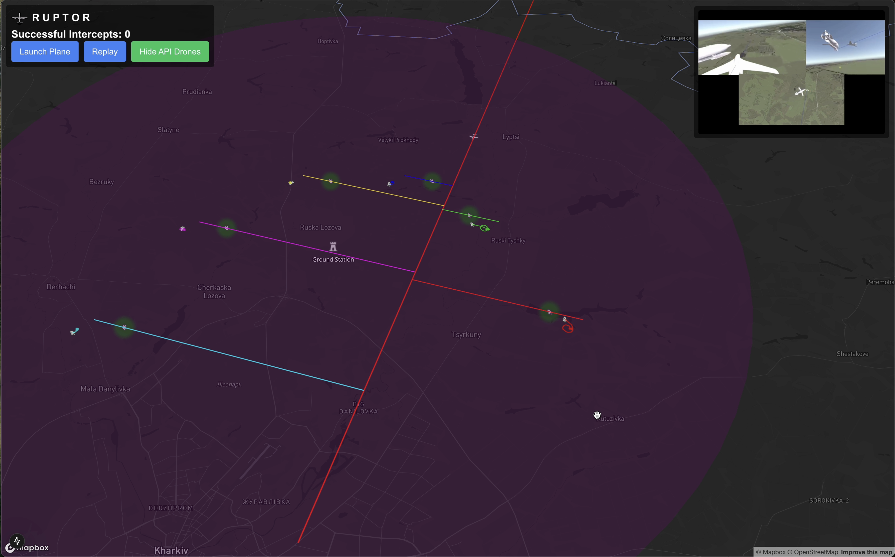

# RUPTOR - Drone Interception Simulation

RUPTOR is an interactive web-based simulation that demonstrates drone-based interception of aerial threats. The project visualizes defensive drones intercepting incoming aircraft using real-time path calculation and collision detection.



## Features

- Real-time 3D visualization using Mapbox GL JS
- Multiple autonomous defensive drones with independent control systems
- Dynamic threat interception calculations
- Ground station radius monitoring
- API-controlled drone integration
- Interactive click-to-launch functionality
- Visual tracking of successful intercepts
- Replay functionality for scenario analysis

## Technical Stack

- **Frontend**: React, Next.js
- **Mapping**: Mapbox GL JS
- **Geospatial Calculations**: Turf.js
- **Styling**: Tailwind CSS

## Installation

1. Clone this repository:

    ```bash
    git clone https://github.com/wennyyustalim/ruptor.git
    cd ruptor
    ```

2. Install dependencies:

    ```bash
    npm install
    ```

3. Create a `.env.local` file in the root directory and add your Mapbox token:

    ```
    NEXT_PUBLIC_MAPBOX_TOKEN=your_mapbox_token_here
    ```

4. Start the development server:

    ```bash
    npm run dev
    ```

## Usage

1. Open the application in your browser (default: `http://localhost:3000`)
2. Click anywhere on the map to set a custom starting position for the threat
3. Click "Launch Plane" to begin the simulation
4. Watch as defensive drones automatically intercept the incoming threat
5. Use "Replay" to restart the simulation
6. Toggle API-controlled drones using the visibility button

## Configuration

Key simulation parameters can be adjusted in `map-working.jsx`:

```javascript
const MULTIPLIER = 5;
const DRONE_SPEED = 45 * MULTIPLIER;
const PLANE_SPEED = 280 * MULTIPLIER;
const REFRESH_RATE = 200;
const NUM_API_DRONES = 6;
```

## API Integration

The simulation supports external drone control through a REST API:

- `GET /api/position/:id` - Get drone position
- `POST /api/set_pos/:id` - Set drone position
- `POST /api/waypoint/:id` - Set drone waypoint

## Contributing

1. Fork the repository
2. Create your feature branch (`git checkout -b feature/AmazingFeature`)
3. Commit your changes (`git commit -m 'Add some AmazingFeature'`)
4. Push to the branch (`git push origin feature/AmazingFeature`)
5. Open a Pull Request

## License

This project is licensed under the MIT License - see the [LICENSE](LICENSE) file for details.

## Acknowledgments

- Mapbox for their excellent mapping platform
- Turf.js for geospatial calculations
- The open-source community for various supporting libraries

## Contact

Your Name - [@yourusername](https://twitter.com/yourusername)

Project Link: [https://github.com/wennyyustalim/ruptor](https://github.com/wennyyustalim/ruptor)
Demo: [Ruptor App](https://interruptor.vercel.app/)
